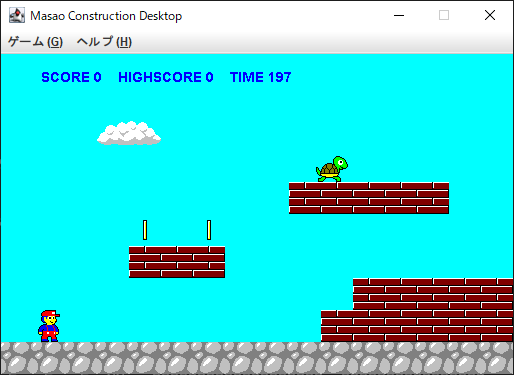
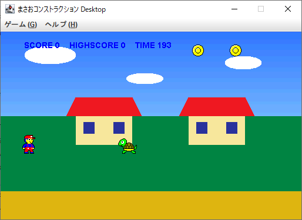

# MasaoMakerSP

まさおメーカーSP

まさおコンストラクションとまさおメーカー SP のオリジナルコードを
できるだけそのまま現代の技術で動かすのを目的としています。

Java Applet は新しい Java では既に非推奨→廃止となっており、
ブラウザ用の Java Plug-in も無くなっているため、基本的に実行環境がありません。
非推奨 API の使用を回避しつつ、Java デスクトップアプリケーションの形で
実行可能にします。

現在は JS まさお (JavaScript 版) に移行しており開発も盛んのようですので、
本プロジェクトの方針は歴史的コードをなるべくそのまま実行可能な形に保つこととします。
昔のアーケードゲームを現代のゲーム機に移植して遊べるようにするイメージです。

## 実行方法

以下よりダウンロード可能です。

リリースページ: <https://github.com/yappy/MasaoMakerSP/releases> \
最新版: <https://github.com/yappy/MasaoMakerSP/releases/latest>

v0.1.3-alpha よりインストーラパッケージに対応しました。
実行に必要な Java ランタイムも同時にインストールされます。

* `*.msi`: Windows 用インストーラ
* `*.deb`: Linux Debian (Ubuntu) 用インストーラ
* `*.zip`: Java ランタイムなしインストーラなし版 (全 OS 用)

## ステータス

* :heavy_check_mark: まさおコンストラクション 2.8 の実行
* :heavy_check_mark: まさおコンストラクション 3.0 の実行
* :x: まさおメーカー SP の実行

<https://github.com/yappy/MasaoMakerSP/issues/3>

## ライセンスについて

### 正男コンストラクション

以下、およびそれと同一ファイルは福田直人様の著作物です。
title.gif にある「このゲームは、転載自由です。」のメッセージの他は
一般の著作権法に準じます。

* original/
  * mc_c.zip
    * コンパイル済み `*.class` のみ。ソース公開はなし。
  * title.gif
  * pattern.gif
  * ending.gif
  * gameover.gif
  * chizu.gif
  * makerpat.gif
    * こちらはオリジナルには含まれませんが、まさおメーカーがマップを描画するために
      私が pattern.gif の一部を抜き出して並べ替えたものです。
    * 私の二次著作物としては認められないと思います。

### それ以外

MIT license: [LICENSE](./LICENSE)

## 開発者向け情報

[こちら](./technote/technote.md)
